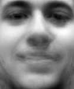
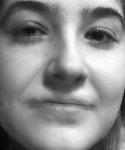

# faceReco

## Reconnaissance faciale par Eigenfaces


### Introduction
Ce projet doit permettre de faire une reconnaissance faciale, en employant des
photos de référence des personnes connues et en soumettant au programme la photo d'une personne à identifier. La reconnaissance est donc limtée à l'emploi d'images en deux dimensions.
La méthode de reconnaissance faciale Eigenfaces emploie la technique de
l’analyse en composante principale, qui marque une différence notable avec les
méthodes plus classiques, appelées méthodes géométriques ou locales, qui se
basent sur les particularités du visage analysé, et dont les défauts résident dans
son manque de précision, ainsi que sa sensibilité aux informations qui ne sont
pas pertinentes.
La méthode utilisée ici est qualifiée de globale, puisque l’ensemble
du visage est alors analysé.

Cette technique de reconnaissance utilise la méthode d’analyse en composantes principales
([PCA]()) ou la méthode de décomposition en valeurs singulières ([SVD](https://fr.wikipedia.org/wiki/D%C3%A9composition_en_valeurs_singuli%C3%A8res)).De manière simple, elle vise a diminuer la dimension de l’espace de travail pour simplifier les données et leur interprétation. Le but est ainsi de prendre en compte les informations importantes qui permettront de reconnaître un visage parmi d’autres avec un bon taux de réussite.

On peut comparer la méthode des visages propres (eigenfaces) aux séries de Fourier qui permettent de représenter un signal périodique à l’aide de sommes de cosinus et de sinus : 

Un signal périodique est la somme de sa valeur moyenne et de ses composantes propres appelées harmoniques (termes en sinus et cosinus). [Séries de Fourier : En savoir plus](http://lumimath.univ-mrs.fr/~jlm/cours/fourier/fouriersos.htm)

<p align="center">
  
</p>


### Les images de références

Dans ce projet, l'approche consiste à représenter un visage comme étant la combinaison linéaire d’un ensemble d’images, ces dernières formant une base de référence.

Les images de référence ou d'apprentissage sont chargées sous forme de matrices de dimensions lxh (largeur x hauteur en pixels) puis transformées en vecteurs :

<p align="center">
  
</p>

```python
from scipy.misc import imread
import glob
import numpy

# Acquisition des images
# pngs : tableau d'images 
pngs = glob.glob('gallery/*.png')

# Lecture de la première image
# acquisition de ses dimensions (hxl) 
image = imread(pngs[0], True)
heigh = len(image[:,0])
length= len(image[0])
print "Dimensions des images : "+str(heigh) + " x "+ str(length)

# Lecture de toutes les images en nuances de gris et transformation en vecteurs
# imgs : tableau des vecteurs d'images de n=hxl dimensions
imgs = numpy.array([imread(i, True).flatten() for i in pngs])
# Affichages des N vecteurs d'images
N = len(imgs)
for i in range(N):
    print "imgs["+str(i)+"]="+str(imgs[i])
```

### Calcul du visage moyen
Le visage moyen est déduit des M visages d’apprentissage. Il traduit les caractéristiques communes à tous ces visages.

<p align="center">
  
</p>

```python
from scipy.misc import imsave
import numpy

# Calcul, affichage et enregistrement de la moyenne des images 
# moyenne : vecteur de l'image moyenne   
moyenne = numpy.mean(imgs, 0)
print "moyenne="+str(moyenne)
# transformation du vecteur moyenne en matrice hxl et enregistrement
imsave("average.png",moyenne.reshape(heigh,length))
```

### Recherche des visages propres
Le visage moyen est soustrait des visages d’apprentissage, ce qui ne laisse alors que les informations propres à chaque visages de référence. 

<p align="center">
  
</p>

*  : Vecteur image de référence (ou d'apprentissage)
*  : Vecteur des caractéristiques propres de l'image 

```python
# Calcul de phi = image - moyenne
# phi : tableau de vecteurs d'images (N lignes x (hxl) colonnes)
phi = imgs - moyenne
```

Les visages propres (eigenfaces) sont issues d'un traitement mathématique qui s'appui sur l'utilisation au choix de la méthode PCA ou SVD. On fait le choix ici d'appliquer la méthode de décomposition en valeurs singulières ([SVD](https://fr.wikipedia.org/wiki/D%C3%A9composition_en_valeurs_singuli%C3%A8res)) :

```python
# Recherche des singularités des images : équivalent à la Covariance
# phi.transpose() : matrice phi transposée
# svd : Singular Value Decomposition
# eigenfaces : matrice unitaire dont les vecteurs singuliers sont en colonnes
# Les colonnes de eigenfaces sont des vecteurs propres. lorsqu'ils sont convertis 
# en matrice hxl, ils correspondent à des images ayant un visage comme apparence.
# Puisqu'il s'agit de vecteurs propres et ont un aspect semblable à un visage, 
# ils sont appelés Eigenfaces. Parfois, ils sont également appelés Ghost Images
# en raison de leur apparence bizarre.

from scipy import linalg
eigenfaces, sigma, v = linalg.svd(phi.transpose(), full_matrices=False)

# Enregistrement des vecteurs eigenfaces (organisés en colonnes) transformés
# en N matrices hxl dans le dossier eigenfaces sous les noms 
# eigenfaces0.png ...eigenfacesN.png (N est le nombre d'images d'origine)
for i in range(eigenfaces.shape[1]): # eigenfaces.shape[1] = nombre de colonnes = N
    imsave("eigenfaces/eigenfaces"+str(i)+".png", eigenfaces[:,i].reshape(heigh,length))
    #print "eigenfaces"+str(i)+".png"+str( eigenfaces[:,i].reshape(heigh,length))
```

### Calcul des poids associés à chaque visages propres
Les images servant à l’apprentissage, auxquels on a enlevé l’image moyenne, sont en fait la combinaison linéaire des visages propres. 

<p align="center">
  
</p>

*  : Visages propres (eigenfaces)
*  : poids associés aux visages propres à partir des caractéristiques propres d'une image de référence (ou d'apprentissage)

```python
# Chaque image d'origine - l'image moyenne (phi) peut être représentée par une 
# combinaison linéaire des vecteurs eigenfaces pondérés :
# phi = weights x eigenfaces ou weight est le vecteur des pondérateurs
# phi est un vecteur organisé en ligne
# eigenfaces est un vecteur organisé en colonne
# il faudrait donc transposer eigenfaces pour réaliser cette opération
# phi = weights x eigenfaces.T
# Donc : weights = phi x eigenfaces.T.T => weights = phi x eigenfaces
weights = numpy.dot(phi, eigenfaces)
```

### Reconstruction d'un visage
La reconstruction des images d'origine consiste à ajouter à l'image moyenne les singularités de chaque eigenfaces pondérées. 
```python
# recon : vecteur de l'image reconstituée
# recon = moyenne + weights x eigenfaces 
# On obtient un jeu de N² images reconstituées
 
for p in range(N):
    for i in range(N):
        recon = moyenne + numpy.dot(weights[p, :i], eigenfaces[:, :i].T)
        img_id = str(p)+"_"+str(i)
        imsave("reconst/img_"+ img_id + ".png", recon.reshape(heigh,length))   
```

<p align="center">
  
</p>

Les meilleurs résultats sont obtenus pour i=N. On peut cependant limiter le nombre d'eigenfaces à tester pour accélerer le processus de reconstruction :
```python
for p in range(N):
    recon = moyenne + numpy.dot(weights[p,:15], eigenfaces[:, :15].T)
    img_id = str(p)
    imsave("reconst2/img_"+ str(img_id) + ".png", recon.reshape(heigh,length))
```

<p align="center">
  
</p>

### Identification d'une personne

L'identification d'une personne consiste à trouver l'image qui lui ressemble le plus parmi les images de référence. La méthode est identique : retirer de l'image à trouver les caractéristiques moyennes puis calculer les pondérateurs avec l'ensemble des eigenfaces connues. On calcul ensuite la distance (méthode des moindres carrés) entre les pondérateurs des images de références et ceux de l'image à tester. 
```python
import matplotlib.pyplot as plt

# lire l'image à tester : amber2.png / zach1.png / erin2.png
img2find = numpy.array(imread("a_tester/zach1.png", True).flatten())
tofind=plt.figure(1)
plt.imshow(img2find.reshape(heigh,length))
plt.title("A trouver")
plt.gray()
tofind.show()
#print "img2find="+str(img2find)
phi2 = img2find - moyenne
w2 = numpy.dot(phi2,eigenfaces)
print "w2 = " + str(w2)
#print "weights = " + str(weights)
dist = numpy.min((weights-w2)**2,axis=1)
print "dist = " + str(dist)
indiceImg = numpy.argmin(dist)
mindist=numpy.sqrt(dist[indiceImg])

print "Distance min : "+str(mindist)
print "Image n° : "+str(indiceImg)
found=plt.figure(2)
plt.imshow(imgs[indiceImg].reshape(heigh,length))
plt.title("Trouver")
plt.gray()
found.show()
raw_input()
```
### Notion de seuil de reconnaissance 
c'est la distance au dela de laquelle on ne peut pas être sur de la reconnaissance.
* Dans le cas de amber2.png qui n'a pas d'image de référence dans le dossier gallery,
on obtient une identification fausse et une distance de 2.36145
* Dans le cas de zach1.png, l'identification est correcte sur une de ses images de
référence pour une distance de 1.05518
* Dans le cas de erin2.png, la correspondance est parfaite avec une distance de 0
On considérera une identification correcte pour une distance inférieure à 2
```python
threshold = 2.0
if mindist <=threshold:
    print "MATCH !"
else:
    print "NO MATCH !"
```

## Application Qt myFaceReco
<p align="center">
  
</p>
