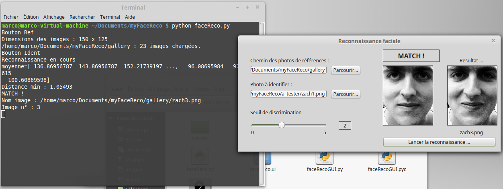

# Application Qt myFaceReco
<p align="center">
  
</p>

### Choisir un dossier

```python
self.directory = str(QFileDialog.getExistingDirectory(self, "Choisir un dossier ..."))
self.lePath2Ref.setText(self.directory)
```

self.directory : contient le nom du dossier sélectionné

### Choisir un fichier

```python
self.fname = QFileDialog.getOpenFileName(self, 'Ouvrir une photo...','.',"Image file PNG (*.png)")
self.lePhoto.setText(self.fname)
# Affiche l'image dans le label lblPhotoToIdent 
self.lblPhotoToIdent.setPixmap(QPixmap(self.fname))
```

self.fname : contient le nom du fichier sélectionné

### Théorie de l'identification

[Cliquez ici](https://github.com/msilanus/faceReco/blob/master/README.md).